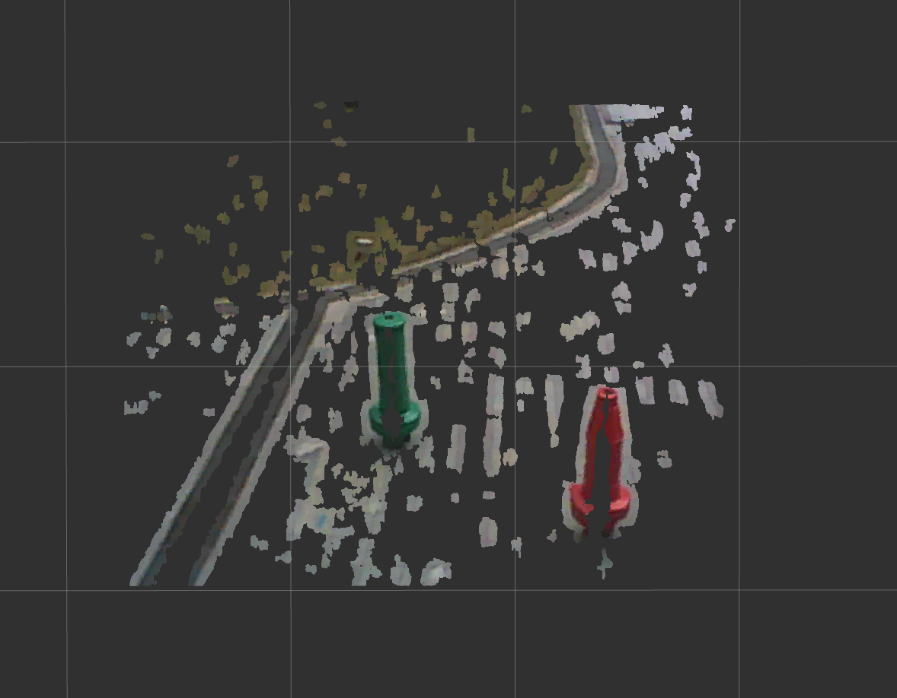
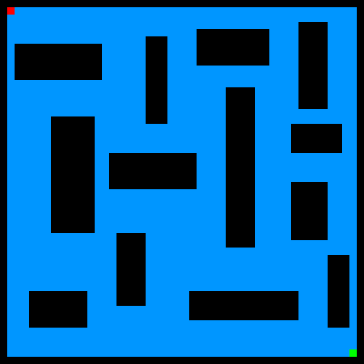

# Obstacle Detection and Avoidance for an Unmanned Surface Vehicle

The objective of this project is to equip the above unmanned surface vehicle (USV) with the ability to operate autonomously. This project contains 2 sections:
  1. obstacle detection using stereo vision and point cloud processing
  1. path planning using Voronoi-Dijkstra algorithm

This project utilizes the following technologies: Ubuntu, ROS, OpenCV, Point Cloud Library
This project utilizes the following algorithms: stereo vision block matching, RANSAC plane segmentation, A* , Dijkstra.

## Part 1: Obstacle Detection

Refer to the [Final Report](./reports/Obstacle_Detection_for_an_Unmanned_Surface_Vehicle.pdf) for full details.

Before using the cameras, we must perform camera calibration:

Using the following obstacle environment:

To determine the location of the obstacles relative to the USV, we use 2 calibrated cameras mounted on the USV and stereo vision block matching algorithm. This is a technique in computer vision to determine how far away image features are from the cameras. This algorithm generates a disparity map:

This disparity map can be converted into a 3D point cloud:

RANSAC plane segmentation algorithm is used to identify the largest plane of point clouds. If done correctly, it should identify the floor or ground. This plane is then removed from the point cloud, leaving only the obstacles:

Finally, take the top down view of the remaining point cloud to obtain a 2D obstacle map for path planning purposes:

## Part 2: Path Planning

Refer to the [Final Report](./reports/Obstacle_Avoidance_for_an_Unmanned_Surface_Vehicle.pdf) for full details.

Using the following obstacle environment:

If A* algorithm is used for shortest path planning:

A* algorithm does not consider the proximity of the path to obstacles. In a maritime environment the USV should maintain a safe distance from obstacles. For this we use Voronoi diagrams to find safe paths (safe paths in blue, unsafe paths in grey), and Dijkstra path planning to find the shortest path available:

